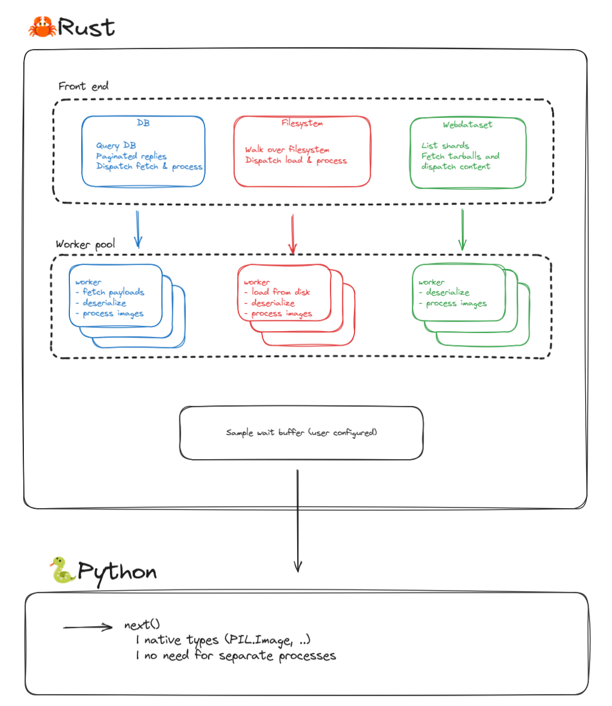

# datago

[](https://github.com/Photoroom/datago/actions/workflows/rust.yml)
[](https://github.com/Photoroom/datago/actions/workflows/ci-cd.yml)

A Rust-written data loader which can be used as a python module. Handles several data sources, from local files to webdataset or a VectorDB focused http stack [soon-to-be open sourced](https://github.com/Photoroom/dataroom). Focused on image data at the moment, could also easily be more generic.

Datago handles, outside of the Python GIL

- per sample IO
- deserialization (jpg and png decompression)
- some optional vision processing (aligning different image payloads)
- optional serialization

Samples are exposed in the Python scope as python native objects, using PIL and Numpy base types. Speed will be network dependent, but GB/s is typical. Depending on the front ends, datago can be rank and world-size aware, in which case the samples are dispatched depending on the samples hash.



<details> <summary><strong>Use it</strong></summary>

You can simply install datago with `[uv] pip install datago`

## Use the package from Python
Please note that in all the of the following cases, you can directly get an IterableDataset (torch compatible) with the following code snippet

```python
from dataset import DatagoIterDataset
client_config = {} # See below for examples
datago_dataset = DatagoIterDataset(client_config, return_python_types=True)
```

`return_python_types` enforces that images will be of the PIL.Image sort for instance, being an external binary module should be transparent.

<details> <summary><strong>Dataroom</strong></summary>

```python
from datago import DatagoClient, initialize_logging
import os
import json

# Respects RUST_LOG=INFO env var for setting log level
# If omitted the logger will be initialized when the client starts.
initialize_logging()

config = {
    "source_config": {
        "sources": os.environ.get("DATAROOM_TEST_SOURCE", ""),
        "page_size": 500,
        "rank": 0,
        "world_size": 1,
    },
    "limit": 200,
    "samples_buffer_size": 32,
}

client = DatagoClient(json.dumps(config))

for _ in range(10):
    sample = client.get_sample()
```

Please note that the image buffers will be passed around as raw pointers, see below (we provide python utils to convert to PIL types).

</details><details> <summary><strong>Local files</strong></summary>

To test datago while serving local files (jpg, png, ..), code would look like the following.
**Note that datago serving files with a lot of concurrent threads means that, even if random_sampling is not set,
there will be some randomness in the sample ordering.**

```python
from datago import DatagoClient, initialize_logging
import os
import json

# Can also set the log level directly instead of using RUST_LOG env var
initialize_logging(log_level="warn")

config = {
    "source_type": "file",
    "source_config": {
        "root_path": "myPath",
        "random_sampling": False, # True if used directly for training
        "rank": 0,
        "world_size": 1,
    },
    "limit": 200,
    "samples_buffer_size": 32,
}

client = DatagoClient(json.dumps(config))

for _ in range(10):
    sample = client.get_sample()
```

</details><details> <summary><strong>[experimental] Webdataset</strong></summary>

Please note that this implementation is very new, and probably has significant limitations still. It has not yet been tested at scale.

```python
from datago import DatagoClient, initialize_logging
import os
import json

# Can also set the log level directly instead of using RUST_LOG env var
initialize_logging(log_level="warn")

# URL of the test bucket
bucket = "https://storage.googleapis.com/webdataset/fake-imagenet"
dataset = "/imagenet-train-{000000..001281}.tar"
url = bucket + dataset

print(f"Running benchmark for {limit} samples")
client_config = {
    "source_type": "webdataset",
    "source_config": {
        "url": url,
        "random_sampling": False,
        "max_tasks_in_flight": 16 # The number of TarballSamples which should be handled concurrently
        "rank": 0,
        "world_size": 1,
    },
    # Optional pre-processing of the images, placing them in an aspect ratio bucket to preseve as much as possible of the original content
    "image_config": {
        "crop_and_resize": crop_and_resize,
        "default_image_size": 1024,
        "downsampling_ratio": 32,
        "min_aspect_ratio": 0.5,
        "max_aspect_ratio": 2.0,
        "pre_encode_images": False,
    },
    "prefetch_buffer_size": 128,
    "samples_buffer_size": 64,
    "limit": limit,
}

client = DatagoClient(json.dumps(config))

for _ in range(10):
    sample = client.get_sample()
```

</details>


## Match the raw exported buffers with typical python types

See helper functions provided in `raw_types.py`, should be self explanatory. Check python benchmarks for examples. As mentioned above, we also provide a wrapper so that you get a `dataset` directly.

## Logging

We are using the [log](https://docs.rs/log/latest/log/) crate with [env_logger](https://docs.rs/env_logger/latest/env_logger/).
You can set the log level using the RUST_LOG environment variable. E.g. `RUST_LOG=INFO`.

When using the library from Python, `env_logger` will be initialized automatically when creating a `DatagoClient`. There is also a `initialize_logging` function in the `datago` module, which if called before using a client, allows to customize the log level. This only works if RUST_LOG is not set.

</details><details> <summary><strong>Build it</strong></summary>

## Preamble

Just install the rust toolchain via rustup

## [Apple Silicon MacOS only]

If you are using an Apple Silicon Mac OS machine, create a `.cargo/config` file and paste the following:

``` cfg
[target.x86_64-apple-darwin]
rustflags = [
  "-C", "link-arg=-undefined",
  "-C", "link-arg=dynamic_lookup",
]

[target.aarch64-apple-darwin]
rustflags = [
  "-C", "link-arg=-undefined",
  "-C", "link-arg=dynamic_lookup",
]
```

## Build a benchmark CLI

`Cargo run --release --  -h` to get all the information, should be fairly straightforward

## Run the rust test suite

From the datago folder

```bash
cargo test
```

## Generate the python package binaries manually

Build a wheel useable locally

```bash
maturin build -i python3.11 --release --target "x86_64-unknown-linux-gnu"
```

Build a wheel which can be uploaded to pypi or related

- either use a manylinux docker image

- or cross compile using zip

```bash
maturin build -i python3.11 --release --target "x86_64-unknown-linux-gnu" --manylinux 2014 --zig
```

then you can `pip install` from `target/wheels`

## Update the pypi release (maintainers)

Create a new tag and a new release in this repo, a new package will be pushed automatically.

</details>

## License

MIT License

Copyright (c) 2025 Photoroom

Permission is hereby granted, free of charge, to any person obtaining a copy
of this software and associated documentation files (the "Software"), to deal
in the Software without restriction, including without limitation the rights
to use, copy, modify, merge, publish, distribute, sublicense, and/or sell
copies of the Software, and to permit persons to whom the Software is
furnished to do so, subject to the following conditions:

The above copyright notice and this permission notice shall be included in all
copies or substantial portions of the Software.

THE SOFTWARE IS PROVIDED "AS IS", WITHOUT WARRANTY OF ANY KIND, EXPRESS OR
IMPLIED, INCLUDING BUT NOT LIMITED TO THE WARRANTIES OF MERCHANTABILITY,
FITNESS FOR A PARTICULAR PURPOSE AND NONINFRINGEMENT. IN NO EVENT SHALL THE
AUTHORS OR COPYRIGHT HOLDERS BE LIABLE FOR ANY CLAIM, DAMAGES OR OTHER
LIABILITY, WHETHER IN AN ACTION OF CONTRACT, TORT OR OTHERWISE, ARISING FROM,
OUT OF OR IN CONNECTION WITH THE SOFTWARE OR THE USE OR OTHER DEALINGS IN THE
SOFTWARE.
